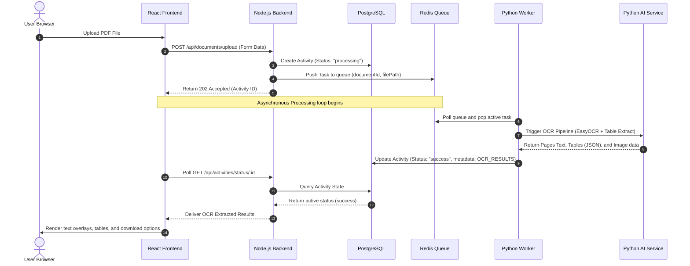
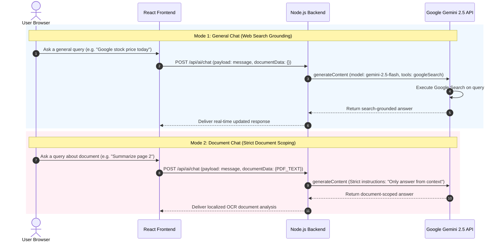
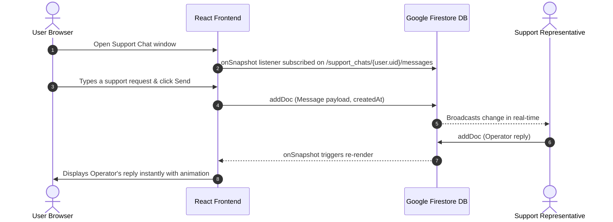
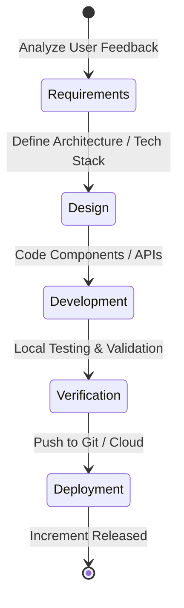

# TextTrack AI: System Design & Architecture

This document provides a comprehensive overview of the system architecture, component topologies, data flows, and the software development lifecycle (SDLC) methodology used to build the **TextTrack AI** document processing platform.

---

## 1. High-Level System Architecture

TextTrack AI is designed using a **containerized microservice architecture**. This ensures high modularity, scalability, and clean boundaries between the UI, business logic, asynchronous worker queues, and machine learning components.

```mermaid
graph TD
    User([User Web Browser]) -->|HTTPS| Frontend[React Frontend SPA <br> Vite + CSS + Lucide]
    
    subgraph Core Platform Services (Dockerized)
        Frontend -->|API Requests / REST| Backend[Node.js Express Backend]
        Backend -->|Query / Mutate| Postgres[(PostgreSQL Database <br> Sequelize ORM)]
        Backend -->|Token Validation & Auth| Firebase[Firebase Auth & Firestore]
        Backend -->|Generate Chat Responses| Gemini[Google Gemini 2.5 API <br> Search Grounding Tool]
        
        Backend -->|Push OCR Tasks| Redis[(Redis Broker & Cache)]
        Worker[Python Background Worker <br> app.worker] -->|Pull Tasks / Update Status| Redis
        Worker -->|Execute OCR Processing| AIService[Python AI Service <br> FastAPI + EasyOCR + Camelot]
    end
```

---

## 2. Technical Stack Decomposition

### Frontend Layer
*   **Vite + React (SPA):** High-performance UI framework rendering components dynamically.
*   **Framer Motion:** Micro-animations for page transitions, interactive cards, and live support slide-ins.
*   **Lucide React:** Premium unified vector iconography.
*   **Firebase Client SDK:** Manages secure Google Sign-In and verifies email auth states.

### Orchestration & Backend API Layer
*   **Node.js & Express:** Lightweight, scalable server framework executing RESTful API endpoints.
*   **Sequelize (ORM) & PostgreSQL:** Manages structured relational entities (Users, Activities, Cached Documents).
*   **Firebase Admin SDK:** Validates client authorization tokens and synchronizes session claims.
*   **Google AI SDK (`@google/generative-ai`):** Communicates with the `gemini-2.5-flash` model.

### Distributed Asynchronous Processing Layer
*   **Redis:** Message broker coordinating asynchronous OCR task processing and caching document results.
*   **Python AI Worker (`app.worker`):** Persistent listener executing heavy CPU/Memory OCR pipelines asynchronously.

### Machine Learning & OCR Engine
*   **Python FastAPI:** High-performance REST wrapper serving ML models.
*   **EasyOCR:** Deep learning-based optical character recognition.
*   **Camelot / PyPDF2:** Extracts complex grid layouts and tabular structures from PDF formats.

---

## 3. Core Operation Lifecycles

### Flow A: Asynchronous PDF Upload & OCR Processing
This sequence ensures large document uploads do not block the web server thread, utilizing Redis as an asynchronous worker queue.



---

### Flow B: Dual-Mode Gemini AI Assistant
To prevent rate-limit crashes and deliver highly precise context, the chat engine operates in two distinct operational modes.



---

### Flow C: Real-Time Live Support Chat (Firestore)
Support requests bypass the Express server entirely, using Firebase Firestore to deliver instant live chat.



---

## 4. Software Development Life Cycle (SDLC) Methodology

This project was built using the **Iterative and Incremental Agile Development Model**. 



### Why Agile Iterative Model?
Because the platform scales dynamically, building the application in full "Waterfall" fashion was not feasible. Instead, we worked in **continuous rapid cycles**:

1.  **Iteration 1 (Core Foundation):** Integrated raw OCR engines, Node.js API structures, and basic layout rendering.
2.  **Iteration 2 (Auth Security):** Migrated local authentication to Firebase to support verified emails and secure Google Auth.
3.  **Iteration 3 (Asynchronous Scaling):** Integrated Redis message brokers and Python Celery workers to handle large PDF timeouts seamlessly.
4.  **Iteration 4 (Export Capabilities):** Added multi-format download capabilities, including Excel tabular exports, Word exports, and custom premium AutoCAD DXF vectors.
5.  **Iteration 5 (Conversational AI Integration):** Engineered the dual-mode Gemini chat engine and enabled Google Search grounding to deliver live web information.
6.  **Iteration 6 (Live Customer Channels):** Configured real-time support chat windows mapped to live Firestore databases.

**Through this Agile cycle, TextTrack AI has progressed from a simple minimum viable product into a highly scalable, enterprise-grade document processing platform.**
